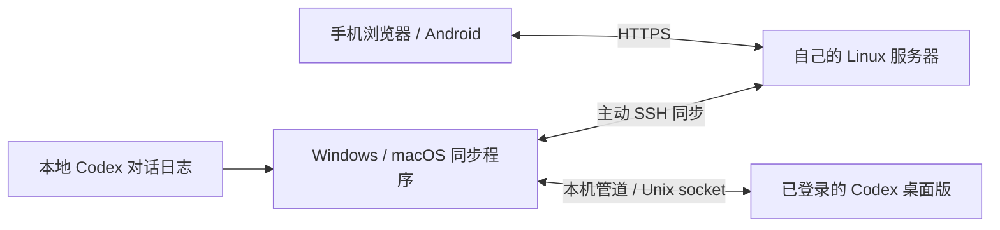

# Codex 随行 · Codex Suixing

用自己的服务器，把电脑上的 Codex 对话带到手机。支持 Windows、macOS 电脑端，手机浏览器和可自行构建的 Android App。

无需 OpenAI 开发者 API Key。对话执行仍由电脑上已登录的 Codex 桌面版完成；服务器只负责同步、网页与消息队列。这是社区项目，与 OpenAI 无隶属关系。

## 功能

- 手机查看 Markdown、代码、表格，折叠较长消息与发送回执。
- Codex 任务续聊、新建独立任务或本机项目任务；发送最多 4 张图片。
- 将桌面已有的 ChatGPT 聊天单独列出，按需加载、文字续聊。
- 空闲每轮等待 5 秒，有交流后等待 2 秒，持续 3 分钟；显示连接延迟和同步时间。
- Android 首次绑定后，使用系统指纹或锁屏凭据解锁，无需反复输入网页密码。
- 电脑端图形界面、后台启停、连接诊断和登录自启。服务器仅依赖 Python 标准库。

**兼容性边界：** 本地日志同步使用跨平台 Python。消息发送和 ChatGPT 功能依赖 Codex 桌面应用的内部 App Tools 协议，属于实验性适配，桌面更新可能改变协议。Windows 已有实际使用；macOS 提供 Unix socket 适配与自动测试，但尚未完成已登录 Codex 的实机端到端验证。普通 ChatGPT Chat 的新建和图片附件目前不可用，不能用 Codex 任务代替。

## 架构



手机只需能连接服务器。电脑需要能访问 Codex / ChatGPT，并保持联网和唤醒。服务器不会收到 Codex 登录文件或账户令牌；它会保存你同步的对话正文与上传图片。请使用自己信任的服务器。

## 开始使用

1. 准备一台 Linux 服务器，安装 Python 3.11+，按 [服务器部署](docs/server.md) 配置专用账号、SSH 和 HTTPS。
2. 电脑安装 Python 3.11+；发送功能还需要 Node.js 20+ 和已登录的 Codex 桌面版。
3. 下载源码并放在固定目录。Windows 双击 `Start Windows.cmd`；Mac 见 [macOS 安装](docs/macos.md)，双击 `Start macOS.command` 或 Release 中的 `.app`。
4. 在电脑端填写 SSH 别名、HTTPS 地址，保存并启动。首次只开启对话同步；按 [桌面连接](docs/desktop-bridge.md) 填写自己的上下文任务 ID 和连接路径，再启用发送。
5. 手机打开自己的 HTTPS 地址，用部署时生成的密码登录。需要 App 时按 [Android 构建](android/README.md) 操作。

### 命令行

macOS / Linux 使用 `python3`，Windows 可替换为 `py -3`：

```sh
python3 companion.py init --ssh-host my-relay --url https://relay.example.com/
python3 companion.py doctor
python3 companion.py start
python3 companion.py status
python3 companion.py stop
python3 companion.py autostart
python3 companion.py autostart --disable
```

`python3 desktop.py` 打开图形界面。关闭界面后同步继续；停止按钮等当前传输完成后退出。更改配置前先停止同步。移动程序目录后，请重新设置自启。Linux 暂不自动安装自启服务，可用 `companion.py run` 配合自己的服务管理器。

### 私有配置

| 平台 | 默认配置、图片、回执和日志目录 |
| --- | --- |
| macOS | `~/Library/Application Support/CodexSuixing/` |
| Windows | `%LOCALAPPDATA%\CodexSuixing\` |
| Linux | `$XDG_STATE_HOME/codex-suixing/`，默认 `~/.local/state/codex-suixing/` |

可用 `--state-dir` 或 `CODEX_SUIXING_STATE_DIR` 覆盖。模板见 [connection.example.json](deployment/connection.example.json)。上下文任务 ID、桌面连接路径、服务器地址均由使用者自己配置；源码不内置任何人的部署入口或账号。

## 同步范围

默认镜像最近 30 个 Codex 主任务，每个保留最近 300 条消息、约 25 万字符。只提取用户内容、助手回答和进度，过滤工具输出、内部推理和环境提示；用户主动写进正文的敏感内容仍会同步。

ChatGPT 列表最多 30 个聊天，正文按需读取最近最多 10 轮。完整历史和已有附件仍在桌面查看。手机上传的 Codex 图片会缩放并重新编码为 JPEG，单张最多 2 MiB；服务器和电脑各有 256 MiB 配额，满额后需手动整理。队列结果不明确时不自动重发，避免重复启动任务。

本项目针对单个用户、单台电脑使用。同一服务器不要同时连接多台独立电脑，因为它们会覆盖同一份快照并争用消息队列。多用户场景请使用独立部署和独立数据目录。

## 开发与验证

```sh
python3 -m unittest -v
node test_desktop.mjs
node test_chatgpt.mjs
node test_markdown.cjs
node test_polling.cjs
python3 scripts/audit_source.py
```

CI 覆盖 Windows、macOS、Linux；桌面协议测试连接隔离的假管道 / Unix socket，不发送真实聊天。`smoke_image_decode.py` 可在本机浏览器验证 PNG / JPEG 解码与损坏图片报错。`scripts/package_release.py` 从 Git 跟踪文件生成源码与 macOS 启动器压缩包，不打包运行数据。

更多说明：[macOS](docs/macos.md) · [部署](docs/server.md) · [桌面桥](docs/desktop-bridge.md) · [安全与隐私](SECURITY.md) · [贡献](CONTRIBUTING.md)。代码采用 [MIT License](LICENSE)；内置 markdown-it 的许可见 [vendor/markdown-it.LICENSE](vendor/markdown-it.LICENSE)。
