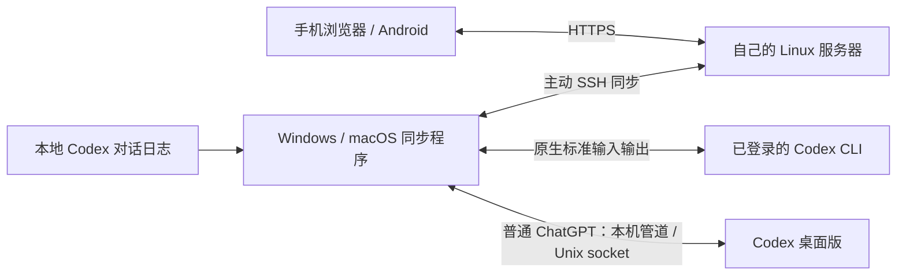

# Codex 随行 · Codex Suixing

用自己的服务器，把电脑上的 Codex 对话带到手机。支持 Windows、macOS 电脑端，手机浏览器和可自行构建的 Android App。

无需 OpenAI 开发者 API Key。Codex 对话由电脑上已登录的官方 CLI 执行；普通 ChatGPT 聊天使用桌面现有通道。服务器只负责缓存、网页与消息队列。这是社区项目，与 OpenAI 无隶属关系。

## 功能

- 手机查看 Markdown、代码、表格，折叠较长消息与发送回执。
- Codex 任务续聊、新建独立任务或本机项目任务；发送最多 4 张图片。
- 将桌面已有的 ChatGPT 聊天单独列出，按需加载、文字续聊。
- 活跃目标周期 1 秒、空闲 10 秒，交流或前台查看激活 3 分钟窗口；持续 SSH 连接避免每轮重新登录。
- 原生文字与独立图片输入，动态模型及思考强度选择；助手正文增量、图片预览、Markdown 和本地公式渲染。
- 手机紧凑布局、App 专用布局、浅色/深色主题；缓存内容先显示再后台更新。
- Android 首次绑定后，使用系统指纹或锁屏凭据解锁，无需反复输入网页密码。
- 电脑端图形界面、异常退出自动恢复、Windows 托盘、后台启停、连接诊断和登录自启。服务器仅依赖 Python 标准库。

**兼容性边界：** Codex 使用原生 `app-server` 协议。桌面持有写入权的旧对话可能无法接管，此时明确失败，不自动跨任务转发；每轮完成后释放 CLI 写入权。普通 ChatGPT 功能仍依赖桌面内部协议。Windows 有实际使用及真实 CLI 隔离协议验证；macOS 提供跨平台与 Unix socket 测试，尚未完成已登录账号的实机端到端验证。普通 ChatGPT Chat 新建和图片仍不可用。云任务仅同步列表与状态。

## 架构


```mermaid
flowchart LR
  Phone[手机浏览器 / Android] <-->|HTTPS| Relay[自己的 Linux 服务器]
  PC[Windows / macOS 同步程序] <-->|主动 SSH 同步| Relay
  Logs[本地 Codex 对话日志] --> PC
  PC <-->|原生标准输入输出| CLI[已登录的 Codex CLI]
  PC <-->|普通 ChatGPT：本机管道 / Unix socket| App[Codex 桌面版]
```

手机只需能连接服务器。电脑需要能访问 Codex / ChatGPT，并保持联网和唤醒。服务器不会收到 Codex 登录文件或账户令牌；它会保存你同步的对话正文与上传图片。请使用自己信任的服务器。

## 开始使用

1. 准备一台 Linux 服务器，安装 Python 3.11+，按 [服务器部署](docs/server.md) 配置专用账号、SSH 和 HTTPS。
2. 电脑安装 Python 3.11+、Pillow（`python3 -m pip install Pillow`）及已登录的 Codex CLI；普通 ChatGPT 功能另外需要 Node.js 20+ 与已登录桌面版。
3. 下载源码并放在固定目录。Windows 双击 `Start Windows.cmd`；Mac 见 [macOS 安装](docs/macos.md)，双击 `Start macOS.command` 或 Release 中的 `.app`。
4. 在电脑端填写 SSH 别名、HTTPS 地址，保存并启动。启用 Codex 发送不需要借用上下文任务；普通 ChatGPT 功能按 [桌面连接](docs/desktop-bridge.md) 配置自己的上下文与连接路径。
5. 手机打开自己的 HTTPS 地址，用部署时生成的密码登录。需要 App 时按 [Android 构建](android/README.md) 操作。

### 命令行

macOS / Linux 使用 `python3`，Windows 可替换为 `py -3`：

```sh
python3 companion.py init --ssh-host my-relay --url https://relay.example.com/
python3 companion.py doctor
python3 companion.py start
python3 companion.py status
python3 companion.py stop
python3 companion.py autostart
python3 companion.py autostart --disable
```

`python3 desktop.py` 打开图形界面。关闭界面后同步继续；停止按钮等当前传输完成后退出。更改配置前先停止同步。移动程序目录后重新设置自启，并更新 SSH 配置中绝对路径的主机密钥文件。Linux 可用 `companion.py supervise` 配合自己的服务管理器。

Windows 启动后带原生托盘：双击打开网页，右键查看状态、暂停/恢复、重启、打开日志、控制登录自启或退出。正常为绿、连接异常为黄、暂停为灰。重复启动保留单个同步及托盘实例；同步重启不会终止独立 CLI 模型服务。

### 私有配置

| 平台 | 默认配置、图片、回执和日志目录 |
| --- | --- |
| macOS | `~/Library/Application Support/CodexSuixing/` |
| Windows | `<程序目录>\.state\`，图片随程序所在磁盘保存 |
| Linux | `$XDG_STATE_HOME/codex-suixing/`，默认 `~/.local/state/codex-suixing/` |

可用 `--state-dir` 或 `CODEX_SUIXING_STATE_DIR` 覆盖。图片在该目录的 `incoming/`、预览在 `media-local/`，配置、回执和私有回环令牌也在同一目录。模板见 [connection.example.json](deployment/connection.example.json)。服务器地址、普通 ChatGPT 上下文及连接路径均由使用者配置；源码不内置个人部署入口或账号。迁移图片路径可用私有 `relocated-paths.json` 映射旧目录到新目录，保留旧历史中的预览。

## 同步范围

默认镜像最近 30 个 Codex 主任务，每个保留最近 300 条消息、约 25 万字符。只提取用户内容、助手回答和进度，过滤工具输出、内部推理和环境提示；用户主动写进正文的敏感内容仍会同步。

ChatGPT 列表最多 30 个聊天，正文按需读取最近最多 10 轮。完整历史和已有附件仍在桌面查看。手机上传的 Codex 图片会缩放并重新编码为 JPEG，单张最多 2 MiB；服务器和电脑各有 256 MiB 配额，满额后需手动整理。队列结果不明确时不自动重发，避免重复启动任务。

本项目针对单个用户、单台电脑使用。同一服务器不要同时连接多台独立电脑，因为它们会覆盖同一份快照并争用消息队列。多用户场景请使用独立部署和独立数据目录。

## 开发与验证

```sh
python3 -m unittest -v
node test_desktop.mjs
node test_chatgpt.mjs
node test_markdown.cjs
node test_polling.cjs
node test_timeline.cjs
node test_math.cjs
node test_formatting.cjs
python3 scripts/audit_source.py
```

CI 覆盖 Windows、macOS、Linux；桌面协议测试连接隔离的假管道 / Unix socket，不发送真实聊天。`smoke_image_decode.py` 可在本机浏览器验证 PNG / JPEG 解码与损坏图片报错。`scripts/package_release.py` 从 Git 跟踪文件生成源码与 macOS 启动器压缩包，不打包运行数据。

更多说明：[macOS](docs/macos.md) · [部署](docs/server.md) · [桌面桥](docs/desktop-bridge.md) · [安全与隐私](SECURITY.md) · [贡献](CONTRIBUTING.md)。代码采用 [MIT License](LICENSE)；内置 markdown-it 的许可见 [vendor/markdown-it.LICENSE](vendor/markdown-it.LICENSE)。
